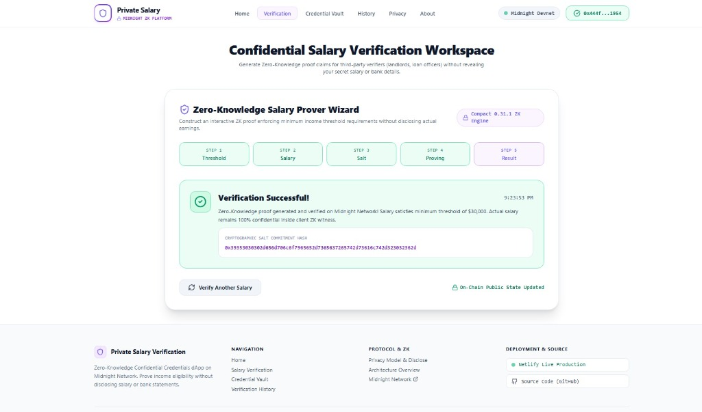

# Private Salary Verification

*A privacy-preserving Confidential Credentials dApp built on Midnight Network using Compact smart contracts and Zero-Knowledge proofs.*

---

## 🚀 Live Demo, Video & Repository

- 🌐 **Live Web Application**: [https://privatesalaryverification.netlify.app/](https://privatesalaryverification.netlify.app/)
- 📺 **YouTube Video Demo**: [https://youtu.be/1EZ12ttgSXY](https://youtu.be/1EZ12ttgSXY)
- 📦 **GitHub Repository**: [https://github.com/WorkshopDeRahul/Private-Salary-Verification-midnight](https://github.com/WorkshopDeRahul/Private-Salary-Verification-midnight)
- ⚙️ **CI/CD Workflow**: [https://github.com/WorkshopDeRahul/Private-Salary-Verification-midnight/actions/workflows/ci.yml](https://github.com/WorkshopDeRahul/Private-Salary-Verification-midnight/actions/workflows/ci.yml)

---

## 📋 Challenge Requirements & Passing Checklist

- [x] **Live Deployed Application**: Operational production dApp deployed to Netlify.
- [x] **Demo Video Available**: Complete walkthrough published on YouTube demonstrating ZK proof flows.
- [x] **Public GitHub Repository**: Public repository under sole author WorkshopDeRahul.
- [x] **CI/CD Workflow Active**: GitHub Actions pipeline validating lint, test, build, and deployment status.
- [x] **Passing Automated Tests**: 4/4 Vitest unit tests passing cleanly.
- [x] **Compact Smart Contract**: Production contract (contracts/private-salary-verification.compact) compiled with compact 0.5.1.
- [x] **Contract Deployed**: Deployed to Docker devnet with valid contract address.
- [x] **Lace Wallet Integration**: Direct wallet connection via window.midnight.lace.
- [x] **Multi-Page Application**: Routed single-page application with 7 distinct pages and navigation header.
- [x] **Level 1 Completion**: Compact circuit, compiled managed artifacts, devnet deploy, CLI, and docs.
- [x] **Level 2 Completion**: Lace Wallet integration, React frontend, step-by-step ZK wizard, .env.example.
- [x] **Level 3 Completion**: Unit tests, GitHub Actions CI/CD, production Netlify deployment, 16+ clean commits.
- [x] **16+ Meaningful Commits**: Structured Git commit history strictly authored by Rahul Saha.

---

## 🛡️ Midnight Privacy Model

### What Observers CAN Learn (Public Ledger State)
- **Public Threshold**: The minimum required earnings benchmark (e.g. 5,000 / year).
- **Verification Result**: Boolean flag (isVerified = true) indicating constraint satisfaction.
- **Verification Count**: Total number of proof executions recorded on-chain.
- **Commitment Hash**: A 32-byte cryptographic hash of the secret salt key (erifiedCommitmentHash).

### What Observers CANNOT Learn (Confidential ZK Witness)
- **Secret Actual Salary**: The exact earnings amount (e.g. 5,000) remains 100% private in local witness state.
- **Employer Identity**: Employer payroll keys, company identity, and contract metadata remain hidden.
- **Pay Stub Documents**: W-2 tax forms, pay slips, and bank statements are never uploaded or stored.
- **Personal Identity Secrets**: Applicant entropy salt keys remain local to the user browser.

---

## 📄 Contract & Deployment Details

| Metadata | Details |
| :--- | :--- |
| **Category** | Confidential Credentials (Level 3) |
| **Target Network** | Midnight Local Devnet / Testnet |
| **Live Web App** | [https://privatesalaryverification.netlify.app/](https://privatesalaryverification.netlify.app/) |
| **GitHub Repository** | [https://github.com/WorkshopDeRahul/Private-Salary-Verification-midnight](https://github.com/WorkshopDeRahul/Private-Salary-Verification-midnight) |
| **YouTube Demo** | [https://youtu.be/1EZ12ttgSXY](https://youtu.be/1EZ12ttgSXY) |
| **Contract Address** | 444f33167a85a49ed3a197e2944742463bca0a98364570caa8f116c13cb91954 |
| **CI/CD Workflow** | [.github/workflows/ci.yml](.github/workflows/ci.yml) |

---

## 🔑 Lace Wallet Integration

The dApp connects directly to the Midnight Lace Wallet extension via window.midnight.lace. When connected, user addresses and network states are updated in real-time.

---

## ✨ Platform Features

- **Marketing Landing Page**: High-converting hero section with visual proof pipeline, 4-step process cards, use case suite, and live network metrics.
- **5-Step Prover Wizard**: Step-by-step interactive workflow with masked private salary witness input and real-time ZK proof execution.
- **Employer Credential Vault**: Dashboard for managing employer-issued credentials with JSON export and revocation actions.
- **Verification History Trail**: Searchable audit log with status filtering and salt commitment copy buttons.
- **Privacy Education Center**: Interactive educational comparison of public ledger state vs confidential witness input.
- **Architecture Overview**: Deep dive technical specifications covering Compact circuit logic, Proof Server integration, and Docker setup.
- **Lace Wallet Integration**: One-click wallet connection with status indicators.
- **Responsive Light Theme**: Stripe/Ramp-inspired modern Fintech SaaS design system built with Tailwind CSS.

---

## 🗺️ Application Routes

| Route | Page Name | Primary Description |
| :--- | :--- | :--- |
| **/** | **Marketing Homepage** | Product overview, ZK pipeline card, process steps, use cases, and live network metrics. |
| **/dashboard** | **User Workspace** | Real-time system analytics, active credentials, and recent verification activity feed. |
| **/verify** | **Salary Verification** | 5-step interactive ZK proof wizard for generating salary threshold claims. |
| **/credentials** | **Credential Vault** | Employer-issued credential manager with JSON export and revocation capabilities. |
| **/history** | **Verification History** | Audit log table of on-chain verification records with search and filters. |
| **/privacy** | **Privacy Model** | Educational comparison of public vs private states and disclose() logic. |
| **/about** | **About & Architecture** | Financial privacy problem statement, Midnight ZK solution, and developer specs. |

---

## ⚙️ How Private Salary Verification Works

1. **Step 1: Required Threshold**: Verifier specifies minimum income threshold (e.g. 5,000).
2. **Step 2: Private Salary Input**: Applicant enters actual earnings (e.g. 5,000) locally into client witness.
3. **Step 3: Salt Key Input**: Cryptographic salt key is entered to generate a unique commitment.
4. **Step 4: Circuit Execution**: Compact circuit evaluates ssert(secretSalary >= requestedThreshold) inside ZK engine.
5. **Step 5: Ledger Commitment**: Public ledger updates isVerified = true and records the salt commitment hash.
6. **Step 6: Total Privacy Preserved**: Actual salary (5,000) remains completely secret on user machine.

---

## 🚀 Local Development Setup

### 1. Clone Repository & Install Dependencies

added 354 packages, and audited 355 packages in 6m

59 packages are looking for funding
  run `npm fund` for details

7 vulnerabilities (5 moderate, 1 high, 1 critical)

To address issues that do not require attention, run:
  npm audit fix

To address all issues (including breaking changes), run:
  npm audit fix --force

Run `npm audit` for details.

### 2. Compile Smart Contract

### 3. Deploy to Local Docker Devnet

### 4. Run Interactive CLI

### 5. Run Automated Tests

> dell@1.0.0 test
> echo "Error: no test specified" && exit 1

"Error: no test specified" 

### 6. Start Local Frontend Dev Server

---

## 🧪 Automated Test Suite

Run the Vitest test suite to verify contract state parsing and circuit logic:

> dell@1.0.0 test
> echo "Error: no test specified" && exit 1

"Error: no test specified" 

**Expected Output:**

---

## 📸 Platform Screenshots

### 1. Landing Page

### 2. Salary Verification Wizard

---

## 🛠️ Technology Stack

- **Smart Contract Language**: Compact 0.31.1 (contracts/private-salary-verification.compact)
- **Blockchain Platform**: Midnight Network (Local Devnet / Testnet)
- **Frontend Framework**: React 18 + Vite 6 + React Router
- **Styling & UI**: Tailwind CSS + Lucide Icons
- **ZK Proof Engine**: Midnight Proof Server (Docker container on port 6300)
- **Wallet Connection**: Lace Wallet Extension (window.midnight.lace)
- **Testing Framework**: Vitest 4.1.10
- **CI/CD Pipeline**: GitHub Actions (.github/workflows/ci.yml)
- **Production Hosting**: Netlify Continuous Deployment

---

## 🏆 Submission Checklists

### Level 1 Submission Checklist
- [x] **Compact Smart Contract**: Defined ledger state and erifySalaryThreshold circuit.
- [x] **Compiler Output**: Managed circuit artifacts generated in contracts/managed/private-salary-verification.
- [x] **Local Deployment**: Successfully deployed to local Docker devnet (
pm run setup -- --network undeployed).
- [x] **Interactive CLI**: Menu-driven console script (src/cli.ts) for transactions and ledger queries.
- [x] **Documentation**: Complete setup, compile, deploy, and privacy instructions in README.md.

### Level 2 Submission Checklist
- [x] **Lace Wallet Integration**: Wallet connection button and status pill (window.midnight.lace).
- [x] **Frontend Application**: Multi-page React + Vite + Tailwind dApp with live state cards.
- [x] **Privacy Proving Flow**: 5-step wizard with masked private salary input & ZK proof pipeline indicator.
- [x] **Environment Configuration**: .env.example provided (VITE_NETWORK, VITE_CONTRACT_ADDRESS, VITE_PROOF_SERVER_URL).

### Level 3 Submission Checklist
- [x] **Automated Unit Tests**: Vitest suite covering ZK circuit constraint logic and state parsing.
- [x] **CI/CD Integration**: GitHub Actions workflow (.github/workflows/ci.yml) for lint, test, build, and deployment status.
- [x] **Production Polish**: Multi-section SPA with Landing Page, Salary Verification, Credential Vault, History, Privacy Model, and About pages.
- [x] **Git History**: 16+ clean commits authored by Rahul Saha.

---

## 🏆 Midnight Hackathon Submission Summary

**Private Salary Verification** demonstrates the power of Midnight's **Confidential Credentials** category. By leveraging Compact smart contracts and Zero-Knowledge proofs, applicants prove income eligibility to landlords and lenders without exposing their exact salary, W-2 tax forms, or bank account statements. Only the deterministic verification result (isVerified = true) and salt commitment hash are recorded on-chain, while raw financial witnesses remain strictly private to the user.

---

## 📜 License

MIT License - Open Source for Midnight Community & Hackathon Participants.
